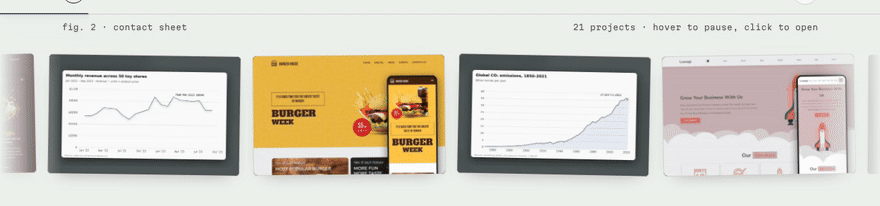
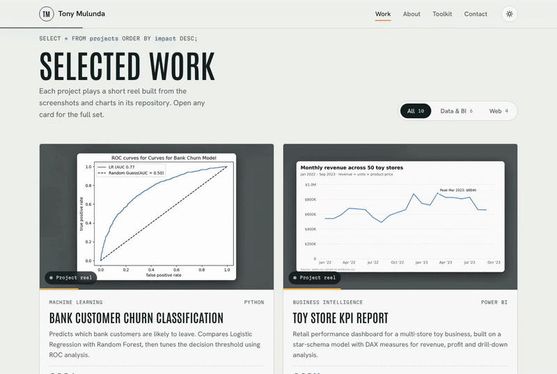
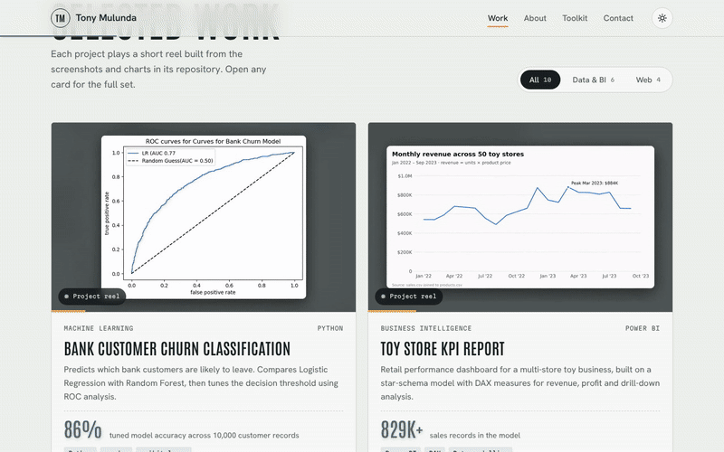
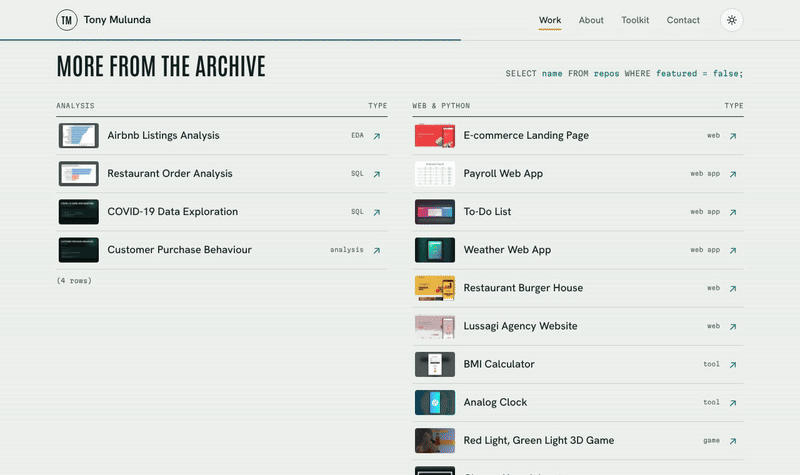
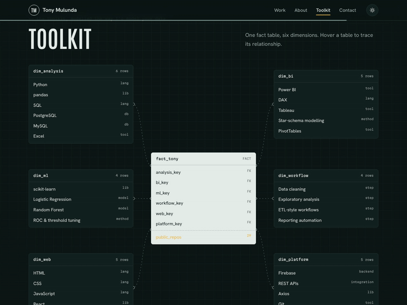
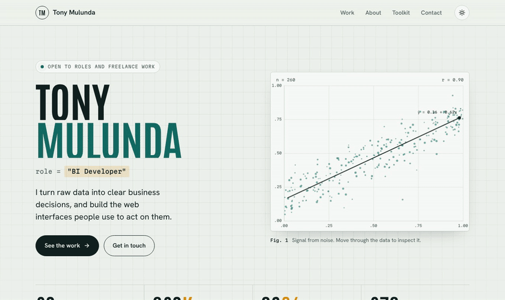
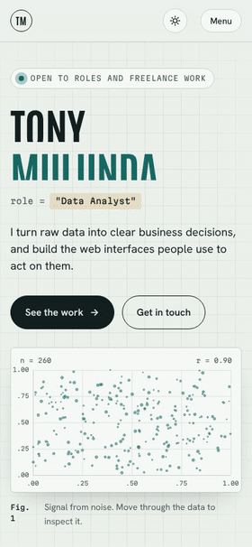

<div align="center">

# Tony Mulunda · Portfolio

**Data Analyst · BI Developer · Front-End Developer**

I turn raw data into clear business decisions, and build the web interfaces people use to act on them.

[](#tech)
[](#tech)
[](#tech)
[](#run-it-locally)
[](#light-and-dark-themes)

[**LinkedIn**](https://www.linkedin.com/in/tony-mulunda/) · [**GitHub**](https://github.com/Scarface96) · [**Email**](mailto:tonymulunda7@gmail.com)

<br>


</div>

---

## About this site

This is my personal portfolio: a single-page site that presents **25 projects** across data analysis, business intelligence, machine learning and front-end development.

The design leans into the work itself. The hero is a live scatter plot that pulls a trend line out of noise, the section headings are written as SQL queries, and the skills section is drawn as a **star schema**, the same way I'd model a client's data. Every featured project plays a short reel built from the charts and screenshots in its repository.

It's plain **HTML, CSS and vanilla JavaScript**. There are no frameworks, no dependencies and no build step, so the whole site is four files plus a `media/` folder.

---

## Highlights

### Signal from noise
The hero chart is drawn on a `<canvas>`. 260 to 520 seeded points (depending on screen width) start scattered, settle into a positive trend, and the least-squares line is fitted and drawn live with its equation and *r* value. Move the cursor over it and a lens magnifies the points underneath, with a readout of the coordinates and how many points fall inside. Alongside it, the role title "decodes" between *Data Analyst*, *BI Developer*, *Front-End Developer* and *Data Engineer*, and the KPI strip counts up on load.

### Contact sheet
A continuous reel of 21 project screenshots, each tilted slightly like prints on a lightbox. Hover to pause and lift a shot; click it to open the project.



### Selected work, with filters
Ten featured project cards, each with a stack, a headline metric and a link to the repository. Each card's reel autoplays when it scrolls into view and pauses when it leaves. The **All / Data & BI / Web** filters rearrange the grid with a smooth FLIP animation rather than a jump.



### Case viewer
Opening a card grows its image into a full viewer. Inside it you can step through the reel and every screenshot, jump to the next or previous project, and use the keyboard (← → to browse, Esc to close) or swipe on touch screens. Focus stays inside the dialog while it's open.



### More from the archive
The remaining projects are listed as query results. Hovering a row floats a live preview of that project next to the cursor.



### The toolkit as a star schema
Skills are modelled as one fact table (`fact_tony`) and six dimensions: analysis, BI, ML, workflow, web and platform. Hover any dimension to trace its relationship back to the fact table.



### Light and dark themes
The site follows your system setting and offers a toggle that remembers your choice.



### Built for phones too

<table>
<tr>
<td width="300"></td>
<td>

The layout reflows to a single column with a compact menu. The hero chart, the reels and the case viewer all work on touch, and the viewer supports swiping between images.

It's also built to be considerate:

- **Reduced motion.** If your system asks for less motion, the reels stop autoplaying and the hero and filter animations are switched off.
- **Accessible.** Skip link, labelled controls, a focus-trapped dialog, alt text and live `aria` states on the filters and menu.
- **Light on the network.** Images are WebP and lazy-loaded, reels only load and play while they're on screen, and the hero chart pauses when it scrolls away.

</td>
</tr>
</table>

---

## Featured projects

| Project | What it is | Tools |
|---|---|---|
| [Bank Customer Churn Classification](https://github.com/Scarface96/Bank-Customer-Churn-Classification) | Predicts which customers will leave; 86% accuracy after ROC threshold tuning on 10,000 records | Python, pandas, scikit-learn |
| [Toy Store KPI Report](https://github.com/Scarface96/Toy-Store-KPI-Report) | Retail dashboard on a star-schema model with 829K+ sales records | Power BI, DAX |
| [B2B Sales Pipeline CRM Dashboard](https://github.com/Scarface96/B2B-Sales-Pipeline-CRM-Dashboard-for-TechSolutions-Inc.) | Pipeline and agent performance across 8,800 opportunities | Excel, PivotTables |
| [Global CO₂ Emissions Dashboard](https://github.com/Scarface96/Global-CO2-Emissions-Dashboard) | Emissions for 278 countries from 1750 to 2021 | Tableau |
| [HR Analytics Dashboard](https://github.com/Scarface96/HR-Analysis-Dashboard) | Attrition analysis across 1,470 employee records | Tableau |
| [Retail Sales SQL Analysis](https://github.com/Scarface96/sql_retail_sales_p1) | Cleaning, EDA and KPI queries with CTEs and window functions | PostgreSQL |
| [Netflix Clone](https://github.com/Scarface96/netflix-clone) | Streaming-style app with sign-in and saved shows | React, Tailwind, Firebase, TMDB API |
| [KAIDIS Coffee Shop](https://github.com/Scarface96/KAIDIS--Coffee-Shop) · [live](https://scarface96.github.io/KAIDIS--Coffee-Shop/) | Responsive landing page for a local café | HTML, CSS, JavaScript |
| [Movie Search App](https://github.com/Scarface96/movie-app) | Film search powered by the OMDb API | React, Axios, styled-components |
| [Weather React App](https://github.com/Scarface96/weather-react-app) | Current conditions for any city | React, OpenWeatherMap |

Fifteen more projects, from an Airbnb listings analysis to a 3D *Red Light, Green Light* game, are in the archive section of the site.

---

## Tech

| Layer | Details |
|---|---|
| **Markup** | Semantic HTML5, Open Graph tags, inline SVG icons |
| **Styling** | Hand-written CSS with custom properties for theming, CSS Grid, `clamp()` type scale |
| **Behaviour** | Vanilla JavaScript: Canvas 2D, IntersectionObserver, Web Animations API (FLIP), `matchMedia` |
| **Fonts** | Antonio (display), Hanken Grotesk (body), Martian Mono (code) via Google Fonts |
| **Media** | WebP screenshots and MP4 reels for each project |

---

## Project structure

```
portfolio-website/
├── index.html        # all page content: hero, contact sheet, work, archive, about, toolkit, contact
├── css/
│   └── style.css     # layout, themes, animations
├── js/
│   ├── projects.js   # project data used by the cards, archive and case viewer
│   └── script.js     # hero chart, filters, viewer, theme, menu and other interactions
└── media/
    └── <project>/    # cover.webp, numbered screenshots (01.webp …) and video.mp4
```

---

## Run it locally

There's nothing to install. Clone the repository and serve the folder with any static server:

```bash
git clone https://github.com/Scarface96/portfolio-website.git
cd portfolio-website
python3 -m http.server 8000
```

Then open <http://localhost:8000>. Opening `index.html` directly also works, but a local server is closer to how it behaves online.

### Publish with GitHub Pages
In the repository go to **Settings → Pages**, choose **Deploy from a branch**, select `main` and `/ (root)`, and save. The site will be live at `https://scarface96.github.io/portfolio-website/` within a minute or two.

---

## Adding a project

1. Create `media/<slug>/` with a `cover.webp`, any screenshots (`01.webp`, `02.webp`, …) and optionally a `video.mp4` reel.
2. Add an entry to the `PROJECTS` array in `js/projects.js` with the slug, title, description, stack, repository link and gallery captions.
3. Add a card (featured) or a row (archive) to `index.html` with `data-open="<slug>"` so it opens in the case viewer.

---

## Contact

I'm open to **Data Analyst**, **BI Analyst** and **Junior Data Engineer** roles, as well as freelance dashboards and websites.

- **Email:** [tonymulunda7@gmail.com](mailto:tonymulunda7@gmail.com)
- **LinkedIn:** [in/tony-mulunda](https://www.linkedin.com/in/tony-mulunda/)
- **GitHub:** [@Scarface96](https://github.com/Scarface96)

<div align="center">
<br>
<sub>© Tony Mulunda. The animated previews in this README were recorded from the live site.</sub>
</div>
