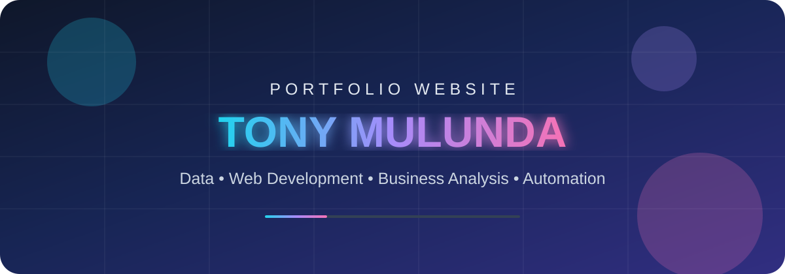
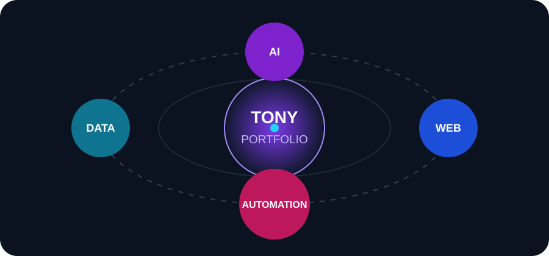
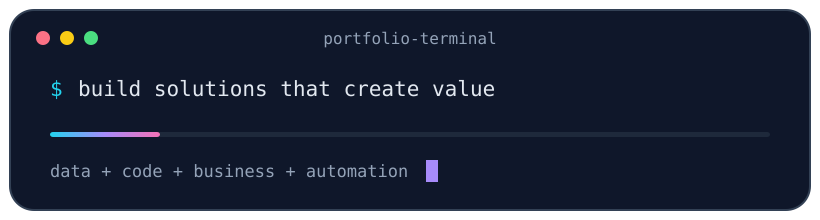

# 👋 Tony Mulunda — Portfolio Website

### Data • Web Development • Business Analysis • Automation

A modern portfolio built to showcase practical projects, analytical thinking, web development skills, automation work, and solutions designed to solve real business problems.

---

## ✨ About This Portfolio

This repository is the home of my personal portfolio website — a professional space where recruiters, businesses, collaborators, and potential clients can explore my work and see how I approach real-world problems.

The portfolio is designed to highlight a blend of **data analysis, frontend development, business analysis, automation, AI-assisted workflows, and problem solving**.

### 🎯 The goal

> Turn technical skills into clear, useful business solutions — and present them in a way that is easy to understand, explore, and trust.

---

## 🚀 What You’ll Find Here

- 📊 **Data & Analytics Projects** — dashboards, insights, reporting, Python, SQL, Excel and business intelligence work.
- 💻 **Web Development Projects** — responsive websites and interactive applications built for real users.
- ⚙️ **Automation Projects** — scripts and systems created to reduce repetitive work and improve efficiency.
- 🧠 **Business Problem Solving** — practical solutions combining technology, analysis and business thinking.
- 🤖 **AI Projects & Experiments** — applications and workflows exploring modern AI capabilities.
- 🧩 **Frontend Experiences** — responsive interfaces with attention to usability, visual hierarchy and interaction.

---

## 🎬 Portfolio in Motion

---

## 🛠️ Core Skills

---

## 💼 What I Can Help With

| Area | Examples |
|---|---|
| **Data Analysis** | Data cleaning, reporting, dashboards, trends and actionable insights |
| **Web Development** | Responsive business websites, landing pages and interactive web apps |
| **Business Analysis** | Process improvement, requirements, reporting and solution design |
| **Automation** | Python scripts, repetitive-task automation and workflow improvements |
| **Frontend Development** | Modern UI development, responsive layouts and user-focused experiences |
| **AI-Assisted Solutions** | AI-enhanced workflows, prototypes and productivity tools |

---

## 🌟 Portfolio Philosophy

I believe a strong portfolio should do more than display code. It should show:

1. **The problem** that needed to be solved.
2. **The thinking** behind the solution.
3. **The technology** used to build it.
4. **The result** or business value created.
5. **What I learned** and how the solution could be improved.

---

## 🗺️ Repository Roadmap

This repository will evolve as the portfolio grows.

- [ ] Publish the full portfolio source code
- [ ] Add project case studies
- [ ] Add live project/demo links
- [ ] Add screenshots and project previews
- [ ] Add performance and accessibility improvements
- [ ] Add deployment workflow
- [ ] Add more data, automation and AI projects

---

## 🤝 Let’s Connect

I’m interested in opportunities, freelance projects, collaborations and conversations around **data, technology, web development, automation and business solutions**.

 

### ⭐ If you like this project, consider starring the repository.

**Built with curiosity, creativity and a focus on solving useful problems.**

